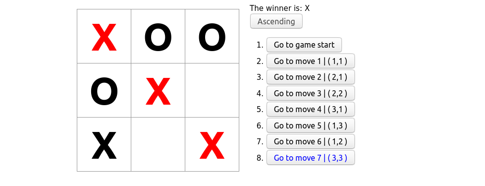

# Description :book:
A 🐱Tic-Tac-Toc🐱 game with Time-Travel 

## ScreenShoot 📸

## Features: 🧰
- Lets you play tic-tac-toe
- Indicates when a player has won the game
- Store game's history as a game progess
- Allow players to review game's history

## Challenges: 💪
- [x] 1. Display the location of each move
- [x] 2. Bold the currently select item in the move lists
- [x] 3. Rewrite the board to use two loops to make the squares instead of hardcoding them.   
- [x] 4. Add a toggle button that let you sort the moves in either ascending or descenging order
- [x] 5. When someone win, highlight the three squares that caused the win.
- [x] 6. When someone no wins, display a message about the result being a draw.

## Final ScreenShoot 📸

